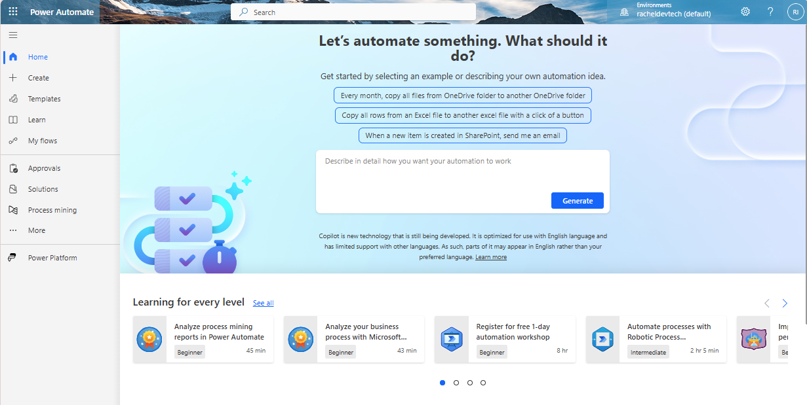
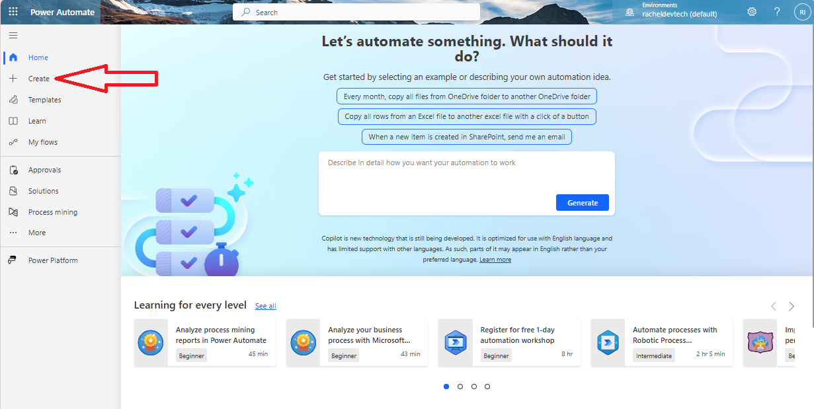
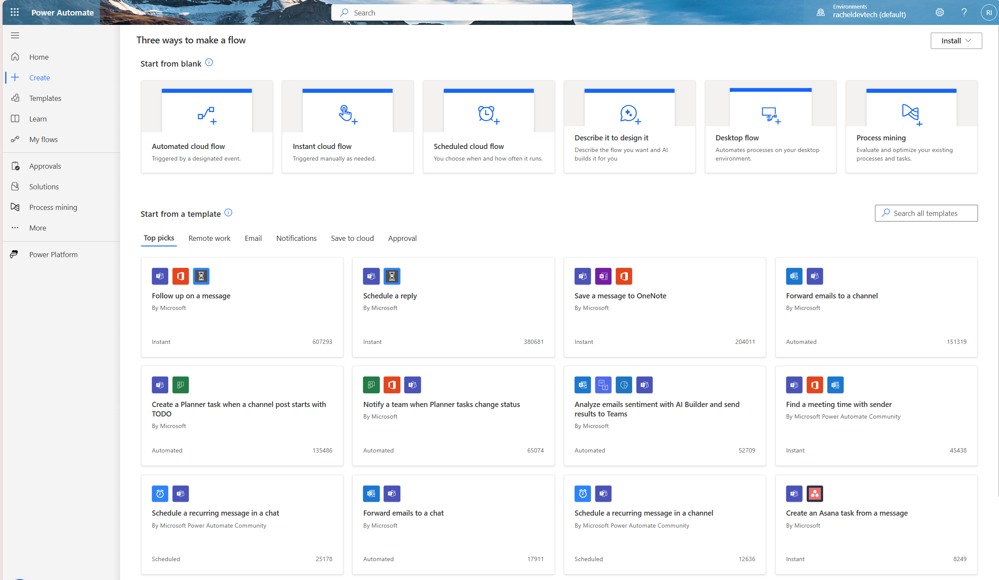
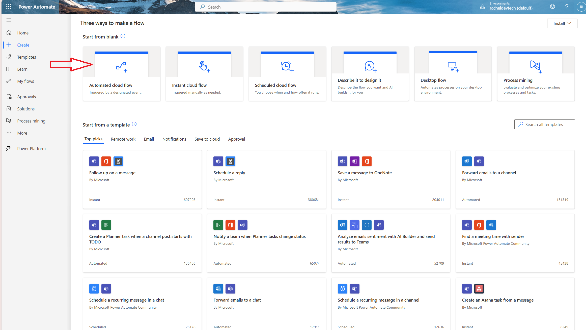
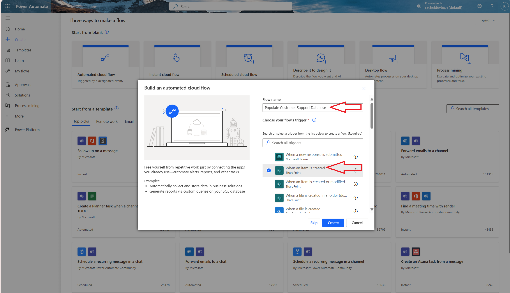
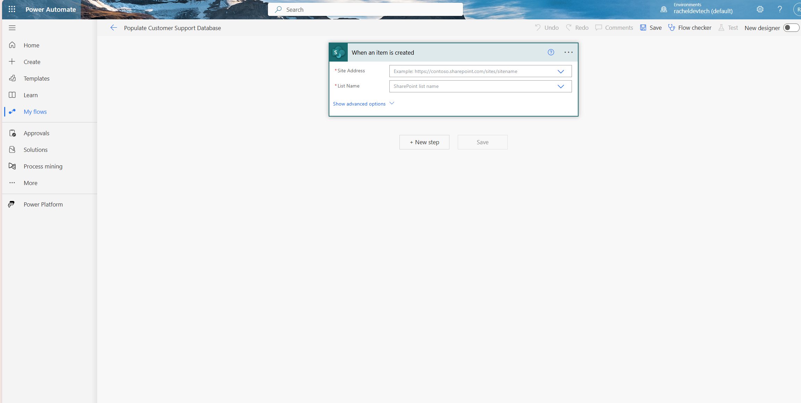
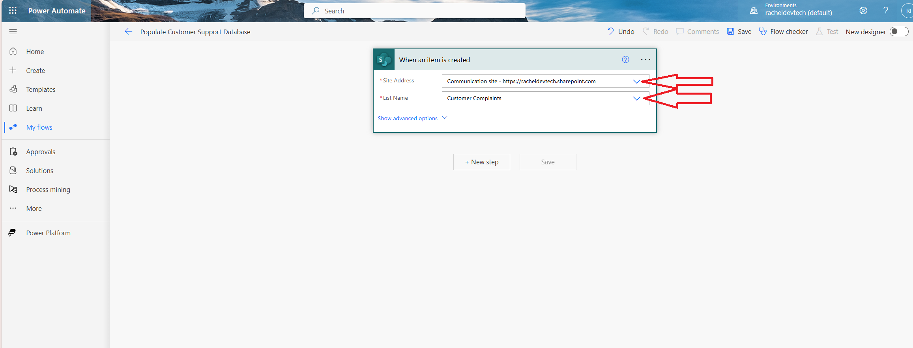
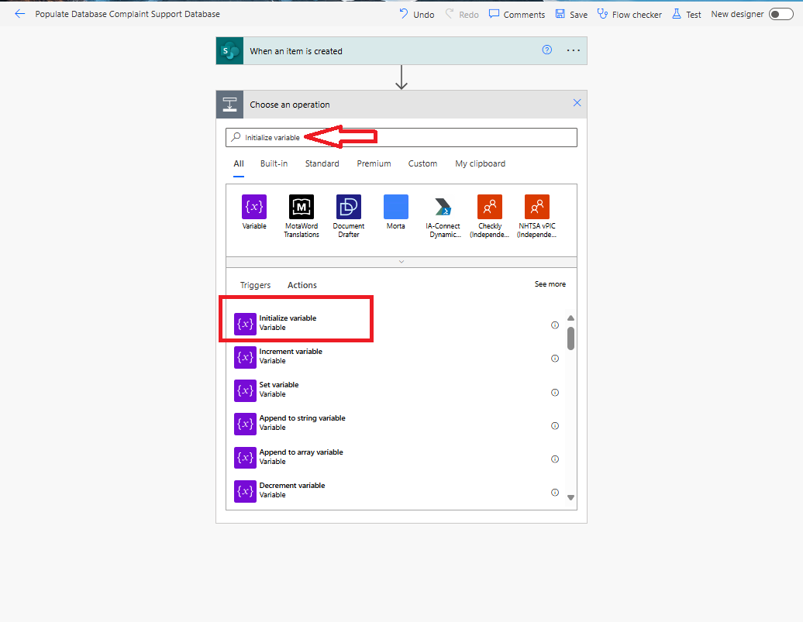
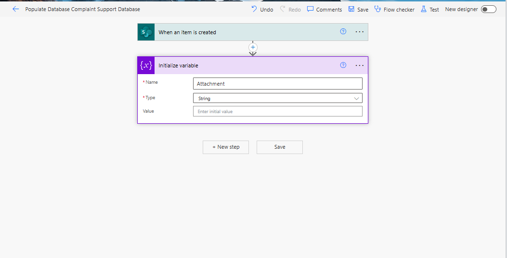

# Save the-data and attachment of an-item from a SharePoint list to another SharePoint list
My name is <a href ="https://www.linkedin.com/in/rachelirabor/">Rachel Irabor</a>, and I’m an MVP for Microsoft Business Application, Power Platform and Dynamics 365 CRM developer and trainer. I love to document what I have learned or encountered. 

Subscribe for the latest <a href ="https://www.linkedin.com/newsletters/ms-business-applications-7056225625308553216/">newsletters</a> and <a href = https://rachelirabor8.medium.com>articles</a> from my Medium and LinkedIn accounts.

If you're working on a solution to save an attachment file from one SharePoint List to another, or need to save the data and attachment of an item from a SharePoint list to a different SharePoint list, check out this blog post.

This can work when an item is created in SharePoint list A and you want the data and attachment created to be saved in another SharePoint list when a condition is met. 

<h2> <b>Use Case: Bank Customer Complaint Management</b></h2>
To illustrate the process, consider this example scenario:

Bank ABC operates a Customer Complaint Management System with various teams handling different categories of customer complaints.

They utilize a SharePoint list named 'Customer Complaints'. Whenever a new item is added to this list and the 'ATM card' is chosen from the 'Type of complaint' choice column, the system automatically stores the data and any attached files from the 'Customer Complaints' SharePoint list into the 'Customer Support Database' SharePoint list.

Disclaimer: This is not an actual bank, but a scenario I created.
 

<h3> <b>Actions to add to your flow to make it possible to save an attachment from SharePoint list A to SharePoint list B</b></h3>

- 1. Get Attachment action

- 2. Get Attachment Content Action

- 3. Add Attachment Action

 
In this context, the Customer Complaint will be referred to as SharePoint list A, and the Customer Support Database will be known as SharePoint list B. This distinction is intended to minimize confusion. 

<b>Prerequisites</b>
Have a Power Automate license/ Developer Account or access to use Power Automate.

 

<h2><strong>Step by Step Process </strong></h2>

1. Go to <a href = "https://make.powerautomate.com/">Power Automate</a>

Figure 2: Power Automate Home Screen.

2. At the left side of the screen, click on Create.

Figure 3: The Power Automate Home Screen displays a red arrow directing attention to 'Create' on the left side of the screen.

Figure 4: Power Automate Create Screen.

3. At the middle of the screen, click on Automated cloud flow. Next, on Flow name add the name of the flow, here I will be using Populate Customer Support Database.

On Choose your flow's trigger, select the trigger When an item is created. Click on Create.

Figure 5: A red arrow pointing to Automated cloud flow in the Power Automate Create screen.

Figure 6: Power Automate flow trigger: When an item is created or modified. The arrow points to where to write the flow's name, the trigger to choose, and where to click Create.

Figure 7: When an item is created trigger.

4. On the trigger 'When an item is created', select your SharePoint site and SharePoint list. Click on the drop-down icon next to Site Address to choose your SharePoint site, and then click on the drop-down icon next to List Name to select your SharePoint list.

Figure 8: A red arrow pointing to the selected SharePoint site and SharePoint list in the trigger when an item is created.

Note: The flow is triggered when an item is created in the Customer Complaint SharePoint list (SharePoint List A).

5. Click "+New step", then search and add the Condition action.

Figure 9: A red arrow points to +New step.

Figure 10: Choose an operation: A red arrow points to the Condition action.
