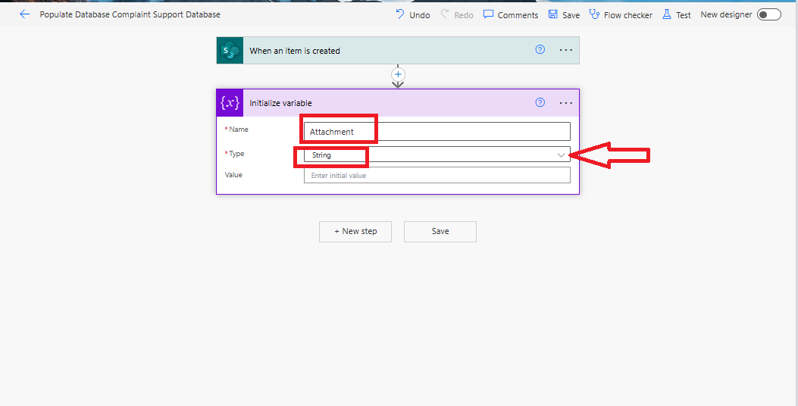

# Save the data and attachment of an-item from a SharePoint list to another SharePoint list
Working on a solution to save an attachment file from one SharePoint List to another, or need to save the data and attachment of an item from a SharePoint list to a different SharePoint list, check out this blog post.

In this blog post, I will show how you can use Power Automate to save an item and attachment from SharePoint list A to SharePoint list B 

This can work when an item is created in SharePoint list A and you want the data and attachment created to be saved in another SharePoint list when a condition is met. 

<h2> <b>Use Case: Contoso Bank Customer Complaint Management</b></h2>
To illustrate the process, consider this example scenario:

Bank ABC operates a Customer Complaint Management System with various teams handling different categories of customer complaints.

They utilize a SharePoint list named 'Customer Complaints'. Whenever a new item is added to this list and the 'ATM card' is chosen from the 'Type of complaint' choice column, the system automatically stores the data and any attached files from the 'Customer Complaints' SharePoint list into the 'Customer Support Database' SharePoint list.

Disclaimer: This is not an actual bank, but a scenario I created.
 

<h3> <b>Trigger and Actions used in the flow</b></h3>

- 1. When an item is created

- 2. Initialize Variable

- 3. Get Items

- 4. Condition 
     - Get Attachments
     - For each
       - Get attachment Content 
       - Create File 
       - Create Sharing link for a file or folder
       - Compose
       - Append to string variable
       - Create Item

 
In this context, the Customer Complaint will be referred to as SharePoint list A, and the Customer Support Database will be known as SharePoint list B. This distinction is intended to minimize confusion. 

<b>Prerequisites</b>
Have a Power Automate license/ Developer Account or access to use Power Automate.

 

<h2><strong>Step by Step Process </strong></h2>

1. Go to <a href = "https://make.powerautomate.com/">Power Automate</a>

Figure 2: Power Automate Home Screen.

2. At the left side of the screen, click on Create.

Figure 3: The Power Automate Home Screen displays a red arrow directing attention to 'Create' on the left side of the screen.

Figure 4: Power Automate Create Screen.

3. At the middle of the screen, click on Automated cloud flow. Next, on Flow name add the name of the flow, here I will be using Populate Customer Support Database.

On Choose your flow's trigger, select the trigger When an item is created. Click on Create.

Figure 5: A red arrow pointing to Automated cloud flow in the Power Automate Create screen.

Figure 6: Power Automate flow trigger: When an item is created or modified. The arrow points to where to write the flow's name, the trigger to choose, and where to click Create.

Figure 7: When an item is created trigger.

4. On the trigger 'When an item is created', select your SharePoint site and SharePoint list. Click on the drop-down icon next to Site Address to choose your SharePoint site, and then click on the drop-down icon next to List Name to select your SharePoint list.

Figure 8: A red arrow pointing to the selected SharePoint site and SharePoint list in the trigger when an item is created.

Note: The flow is triggered when an item is created in the Customer Complaint SharePoint list (SharePoint List A).

5. Click "+New step", then search and add the Condition action.

Figure 9: A red arrow points to +New step.

Figure 10: Choose an operation: A red arrow points to the Condition action.

Figure 11: The Condition action.

6. In the Condition action, click on "Choose a value" on the left side of the Condition action. In the Dynamic content section, search and add the choice column you wish to base your condition on. For this example, I will select "Type of Complaint Value".

Next, on Choose a Value on the right side, here I will write Alert as shown in figure 11. (We have options in the 'Type of Customer Complaint' choice column, but in this case, I want the flow to execute under the condition that whenever an item is created in the Customer Complaint SharePoint list and 'Alert' is selected as the type of complaint, the item and its attachment should be saved to the Customer Support Database).

Next, modify 'Is equal to' to 'contains' as shown in figure 14.

Figure 12: A red point to the Choose a value at the right side of the Condition action and another red arrows point to the Dynamic content "Type of Complaint Value".

Figure 13: In the middle of the Condition action, a red arrow points to contains and at the right side of the Condition action a red arrow points to the word "Alert".

7. Here, we will be storing the items retrieved from the Customer Complaint SharePoint list (SharePoint list A) into the Customer Support Database (SharePoint list B). In the If yes of the Condition action, click on Add an action. Search and add the action Create item. On Site address and List name, select the SharePoint list you need to save the data and attachment to (which is SharePoint list B).

Now, let's add the data from the columns we wish to save from the Customer Complaint (SharePoint list A) to the Customer Support Database (SharePoint list B). Create item action; in the 'AccountNumber' field, from the dynamic content, search and select the 'AccountNumber' dynamic content (originating from the trigger when an item is created).

